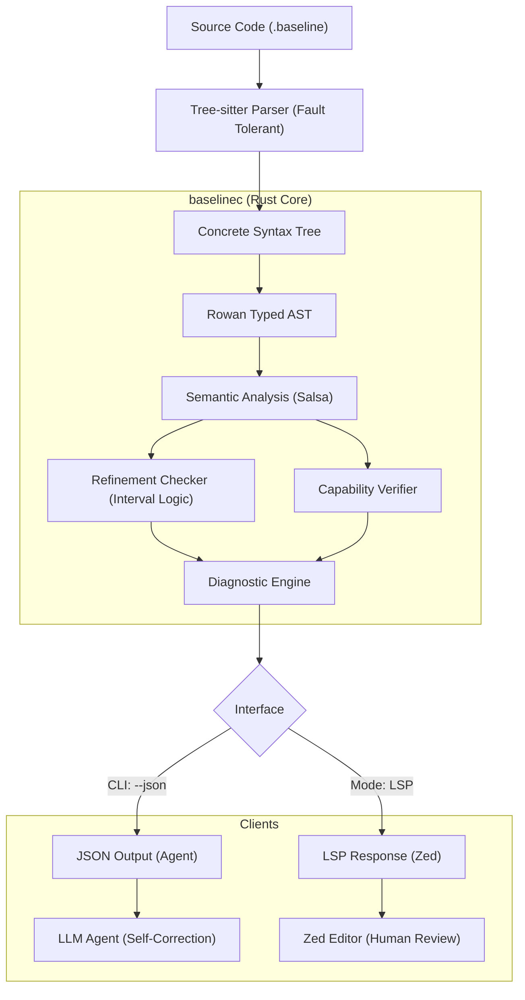

Here is the formal **Technical Specification for the Baseline Toolchain (v0.1.0)**. This document serves as the implementation blueprint for the engineering team.

---

# Baseline Technical Specification

**Version:** 0.1.0 — Bootstrap Implementation
**Target:** Compiler Engineering & Tooling
**Status:** Approved for Development

---

## 1. Executive Summary

Baseline v0.1 is designed to be the "Correction Layer" for AI coding agents. Unlike traditional compilers that optimize for binary generation, the Baseline compiler is optimized for **structured feedback**.

The system implements a **Dual-Head Architecture** powered by a single Rust binary (`baselinec`):

1. **Head A (The Agent):** A batch-processing CLI that emits structured JSON diagnostics with deterministic fix-patches, allowing Agents to self-repair code without human intervention.
2. **Head B (The Human):** A real-time Language Server (LSP) and Zed Editor extension designed for "Cognitive Safety," using syntax highlighting to visually alert human reviewers to side effects and logic constraints.

To enable rapid iteration, v0.1 simplifies the memory model to **Atomic Reference Counting (Arc)** while enforcing the full surface syntax and verification logic defined in the Language Spec.

---

## 2. System Architecture

The project is structured as a Monorepo to ensure the grammar, verification core, and editor tooling share a single source of truth.



### 2.1 Repository Structure

```text
baseline-lang/
├── Cargo.toml                  # Workspace definition
├── tree-sitter-baseline/         # [SOURCE OF TRUTH] Syntax definition
│   ├── grammar.js              # JavaScript grammar definition
│   ├── src/                    # Generated parser
│   └── queries/                # Semantic highlighting rules (.scm)
├── baselinec/                    # [CORE] Compiler & Analysis
│   ├── src/
│   │   ├── main.rs             # CLI entry point (Dual-mode)
│   │   ├── syntax.rs           # Tree-sitter -> Rowan (Typed AST)
│   │   ├── analysis.rs         # Verification logic
│   │   ├── json_api.rs         # Agent Protocol implementation
│   │   └── server.rs           # Tower-LSP server implementation
├── extensions/
│   └── baseline-zed/             # [HUMAN UI] Zed Editor Extension
│       ├── extension.toml
│       ├── languages/          # Zed language config
│       └── tree-sitter-baseline.wasm
└── pybaseline/                   # [INTEGRATION] Python bindings for Agents
    └── src/lib.rs              # PyO3 bindings for the compiler

```

---

## 3. Component A: Syntax Layer (`tree-sitter-baseline`)

**Goal:** Provide fault-tolerant parsing and specific semantic tagging for "Safety Highlighting."

### 3.1 Grammar Definition (`grammar.js`)

We must capture Baseline's specific safety features as distinct nodes to enable the editor to color them differently (e.g., Red for side effects, Gold for capabilities).

```javascript
module.exports = grammar({
  name: 'baseline',

  extras: $ => [ /\s/, $.comment ],

  rules: {
    source_file: $ => repeat($._definition),

    _definition: $ => choice(
      $.function_def,
      $.type_def,
      $.effect_def
    ),

    // 1. Refinement Types: Explicit 'refinement' node for highlighting
    // Example: type Port = Int where self > 0
    type_def: $ => seq(
      'type', field('name', $.type_identifier), '=', 
      field('def', $._type_expr),
      optional(field('refinement', $.refinement_clause))
    ),

    refinement_clause: $ => seq('where', $.predicate),

    // 2. Effectful Functions: Captures '!' suffix
    // Example: run_db!
    // Regex ensures any identifier ending in ! is parsed as a "danger" node
    identifier: $ => /[a-z_][a-z0-9_]*!?/, 

    // 3. Effect Sets: Semantic distinction from generic types
    // Example: {Http, Db}
    effect_set: $ => seq('{', commaSep1($.type_identifier), '}'),

    // ... standard literals and tokens
  }
});

```

---

## 4. Component B: The Compiler Core (`baselinec`)

**Stack:** Rust (2024), `salsa` (Incremental Computation), `rowan` (Lossless Syntax Tree).

### 4.1 Verification Tiers (v0.1)

To achieve sub-50ms latency for Agents, verification uses heuristics rather than SMT solving in this phase.

1. **Level 1 (Effects):** Capability checking.
* *Logic:* Traverse the AST. If a function call ends in `!` (e.g., `fs.delete!`), verify the current function signature contains the corresponding Effect (e.g., `{Fs}`).


2. **Level 2 (Fast Refinement):** Interval arithmetic.
* *Logic:* Track integer bounds. If `type Port = Int where self < 65535` and user passes `70000`, detect `70000 > 65535`.


### 4.2 The Agent Protocol (JSON Output)

The CLI command `baselinec check file.baseline --json` emits a schema optimized for In-Context Learning. It prioritizes **Fix Diffs**.

```json
{
  "status": "failure",
  "diagnostics": [
    {
      "code": "CAP_004",
      "severity": "error",
      "location": { "file": "src/api.baseline", "line": 12, "col": 4 },
      
      // Context: Explain WHY it failed in concepts the LLM understands
      "message": "Unauthorized Side Effect: 'Fs.write!'",
      "context": "Function 'process' declares effects {Log}, but calls 'Fs.write!' which requires {Fs}.",
      
      // Solution: Deterministic diffs the Agent can apply blindly
      "suggestions": [
        {
          "strategy": "escalate_capability",
          "description": "Add Fs to the function signature",
          "patch": {
            "start_line": 10,
            "original_text": "process : Data -> {Log} Result",
            "replacement_text": "process : Data -> {Log, Fs} Result"
          }
        },
        {
          "strategy": "remove_call",
          "description": "Delete the unauthorized call",
          "patch": {
            "start_line": 12,
            "operation": "delete_line"
          }
        }
      ]
    }
  ]
}

```

---

## 5. Component C: The Human Interface (Zed Extension)

**Goal:** Cognitive Safety. The reviewer must instantly identify side effects and constraints.

### 5.1 Extension Config (`extension.toml`)

```toml
[extension]
id = "baseline"
name = "Baseline"
version = "0.0.1"

[grammars.baseline]
repository = "https://github.com/baseline-lang/tree-sitter-baseline"
commit = "HEAD"

[language_servers.baseline]
command = "baselinec"
args = ["lsp"]

```

### 5.2 Safety Highlighting (`highlights.scm`)

We map the specific grammar nodes defined in Section 3.1 to visual alerts.

```scheme
; --- SAFETY LAYER ---

; 1. Visualizing the Sandbox
; Effect sets {Http, Db} are colored Gold/Yellow
(effect_set (type_identifier) @constant)

; 2. Visualizing Danger
; Functions ending in '!' are colored Red/Orange
((identifier) @function.method.dangerous
 (#match? @function.method.dangerous "!$")) 

; 3. Visualizing Invariants
; 'where' clauses are colored Purple/Control
(refinement_clause "where" @keyword.control)

```

---

## 6. Implementation Roadmap

### Phase 1: The Syntax Foundation (Week 1)

* **Goal:** Visual validation in Zed.
* **Deliverables:**
* `tree-sitter-baseline` repo with grammar implementation.
* `.wasm` parser compiled.
* `baseline-zed` extension demonstrating "Danger Highlighting" (Red `!`, Gold `{}`).


### Phase 2: The Agent Validator (Weeks 2-3)

* **Goal:** Agents can run a "Check Loop" and fix syntax/effect errors.
* **Deliverables:**
* `baselinec` binary with `clap` CLI.
* Rust AST lowering (`rowan`).
* Capability Checker (Effect system).
* JSON Output formatting.


### Phase 3: The Integration Layer (Week 4)

* **Goal:** "Hello World" execution inside a Python Agent environment.
* **Deliverables:**
* Tree-walk Interpreter in Rust (using `Arc` for memory).
* `pybaseline` bindings (via `pyo3`) allowing `import baseline; baseline.run(code)`.
* `baseline_context.md`: The "System Prompt" file that teaches LLMs the language syntax.
